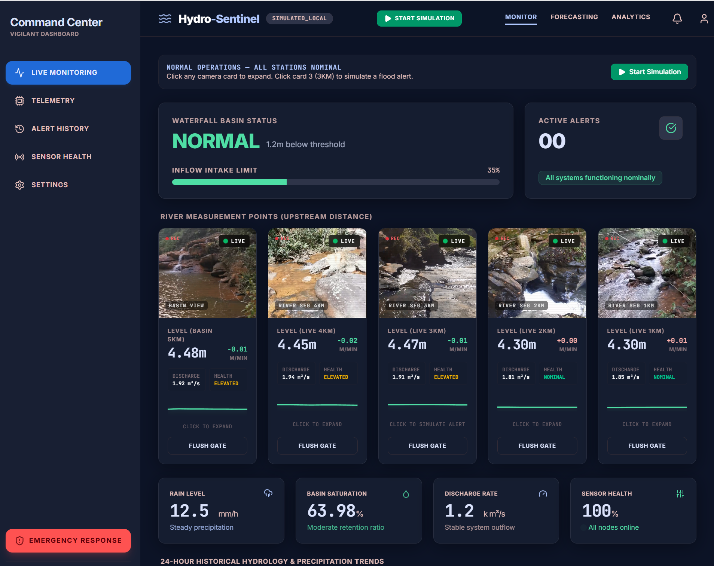
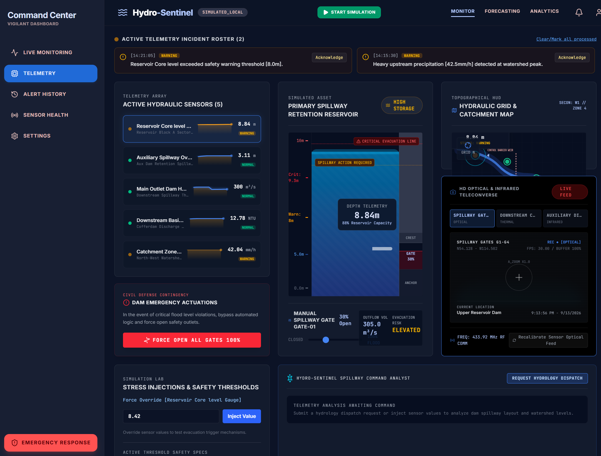
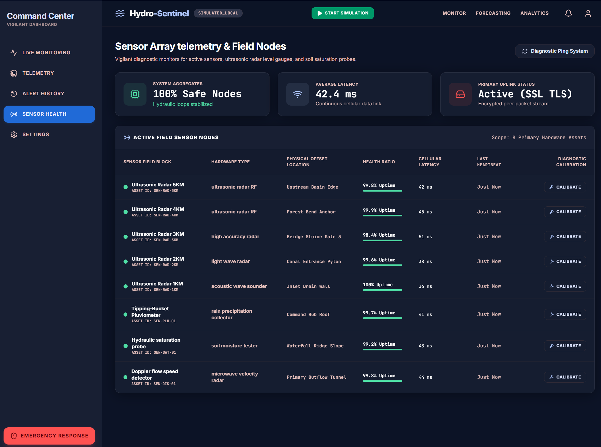

# Hydro-Sentinel

**Real-time river monitoring and flood alert simulation dashboard.**

> Educational project — a React + Spring Boot demonstration of a civil protection command center for hydraulic spillway and river basin monitoring.
>
> **You do not need Node.js to run this project.** The frontend is already compiled and committed as static files. The React/TypeScript source is included only so that anyone can customize the UI — see [Running locally](#running-locally).

## What is this?

Hydro-Sentinel is a simulated monitoring platform that visualizes water levels across five upstream measurement points along a river, feeding into a waterfall basin swimming area. The application was built as a learning exercise to explore:

- Multi-view dashboard architecture (normal operations, flood alarm, telemetry, and system configuration)
- Real-time data simulation with dynamic water level propagation
- Video feed integration with scenario-based switching (normal vs. flood footage)
- Interactive alerting workflows with staged escalation
- Spring Boot REST API backend with JPA persistence
- Component composition with React, TypeScript, Tailwind CSS, and Vite

## Dashboard views

| View | Purpose |
|------|---------|
| **Live Monitoring** (`normal`) | All stations nominal. Click card 3 to trigger a simulated flood. |
| **Flood Alarm** (`alarm`) | Station 4KM in alert state. Flood videos play. Flush gate to resolve. |
| **Telemetry** | Independent spillway reservoir view with sensor arrays, topographic map, and gate controls. |
| **Settings** | Alert recipient management, threshold sensitivity sliders, and operational rules. |

#Dashboard:



#Telemetry


#System Health



## Project structure

```
hydro-sentinel/
├── hydro-sentinel-domain/     # JPA entities, DTOs, repository interfaces
├── hydro-sentinel-sensor/     # Sensor ingestion module (stub)
├── hydro-sentinel-alert/      # Alert evaluation module (stub)
├── hydro-sentinel-api/        # Spring Boot REST API + static frontend
└── hydro-sentinel/            # React frontend source (Vite) — optional, only for UI customization
    └── src/
        ├── components/        # Dashboard UI components
        ├── config/            # Configuration files (see below)
        ├── hooks/             # React hooks
        └── services/          # Scenario logic
```

---

## Architecture philosophy: source code vs. running application

An important distinction for anyone contributing to this project:

**The browser and the Spring Boot Java backend do not run `.tsx` or `.ts` files directly.**

- The **source code** you edit lives in `hydro-sentinel/src/` as human-readable TypeScript and React files (`.tsx`, `.ts`). This is where all development happens.
- The **running application** served to browsers consists entirely of compiled, static files — plain HTML, minified CSS, and bundled JavaScript (`.js`) — located inside the Java API module's resources directory at:

  ```
  hydro-sentinel-api/src/main/resources/static/
  ```

Spring Boot serves this `static/` directory as a standard web root. The browser never sees a `.tsx` file. It only receives the compiled output that Vite produces from those sources. This separation is the foundation of the project's build pipeline and must be understood before making any changes.

**The React/TypeScript source is optional.** It is included so anyone can restyle the UI, but nothing about building, running, or deploying the application requires Node.js — only *changing* the UI does. The compiled output is committed to the repository, so `mvn` plus `java -jar` is all you need to run the app as-is.

---

## Development workflow: changing the UI (requires Node.js)

**Skip this section if you just want to run the application** — see [Running locally](#running-locally). This workflow only applies when you want to modify the dashboard design or behavior.

Every dashboard change follows a strict two-step process. **Skipping step 2 means your edits will not appear in the browser.**

### Step 1 — Modify the source

Make your code edits inside the human-readable `.tsx` and `.ts` files located under:

```
hydro-sentinel/src/
```

This is where you add components, change layouts, update state logic, tweak styles, or modify configuration files like `cameraConfig.ts`.

### Step 2 — Compile and convert

Open a terminal in the `hydro-sentinel/` directory (the Vite project root) and run:

```bash
npm run build
```

This command is the bridge between source code and running application. Under the hood, it:

1. Runs the TypeScript compiler to type-check all `.ts` and `.tsx` files.
2. Invokes Vite to bundle, tree-shake, and minify every React component, CSS rule, and imported asset.
3. Writes the resulting plain HTML and scrambled `.js`/`.css` bundles into the Spring Boot static resources directory:

   ```
   hydro-sentinel-api/src/main/resources/static/
   ```

4. Copies any files from the `public/` folder (such as mock videos) into that same output directory.

After the build completes, restart the Spring Boot server (or let it hot-reload if already running), then refresh your browser. Your changes are now live.

> **Key rule:** if you edit a `.tsx` file and reload the browser without running `npm run build`, nothing changes. The browser only knows about the static bundles produced in step 2.

---

## Camera feeds

The five monitoring stations display **pre-recorded mock videos** located in `hydro-sentinel/public/videos/`. These are looping MP4 clips that simulate river camera footage under normal and flood conditions.

### Switching to real camera feeds

Edit `hydro-sentinel/src/config/cameraConfig.ts`:

```ts
// Set this to true to use live IP camera streams
export const USE_LIVE_FEEDS = false;

export const CAMERA_CONFIG = {
  'st-1km': {
    local: '/videos/MAST-01.mp4',        // mock video
    live: 'http://192.168.1.101/stream', // ← replace with real RTSP/HTTP stream
  },
  'st-2km': {
    local: '/videos/MAST-02.mp4',
    live: 'http://192.168.1.102/stream', // ← replace
  },
  // ... st-3km, st-4km, st-5km each have local + live entries
};
```

After editing the configuration, run `npm run build` to compile the changes into the static bundle served by Spring Boot.

Each of the 5 stations can independently point to a real IP camera or RTSP stream. Flood/alarm variants (e.g., `MAST-04-FLOOD.mp4`) can also be replaced with live feeds for emergency scenarios.

---

## Sensor data

Water level, flow rate, and rate-of-change data are currently **simulated client-side** via a timed interval loop that mimics sensor telemetry ticks. Each of the 5 stations has configurable per-station properties (level, rate of change, sparkline history) stored in the `App.tsx` source file as React component state.

### Integrating real IoT sensors

To swap out the mock simulation for real production IoT sensor data, a developer must:

1. Create a sensor configuration file (e.g., `src/config/sensorConfig.ts`) with per-station IoT endpoint URLs, polling intervals, and authentication tokens — following the same pattern established in `cameraConfig.ts`.

2. Modify the underlying simulation logic loop in the `App.tsx` source file, replacing the mock data generator with a `fetch`/poll loop that reads live readings from your physical sensor endpoints.

3. Run `npm run build` to compile those TypeScript source changes into the static JavaScript bundle that the browser actually executes.

4. The Spring Boot backend in `hydro-sentinel-api` already provides REST endpoints (`/api/stations`, `/api/sensors`, `/api/telemetry`) that can serve as a proxy layer between the frontend and your physical sensor network.

---

## Tech stack

| Layer | Technology |
|-------|-----------|
| Frontend source | React 19, TypeScript, Tailwind CSS 4 |
| Frontend build | Vite 6 (compiles `.tsx` → static `.js`/`.html`/`.css`) |
| Backend | Java 21, Spring Boot 3.3, Spring Data JPA |
| Database | H2 (file-based, dev) / PostgreSQL (production) |
| Charts | Custom SVG sparklines and multi-line trend charts |
| Animations | Motion (Framer Motion) for reservoir visualization |

---

## Running locally

### Option 1 — Run the application (no Node.js required)

The compiled frontend is already committed to the repository, so running the app needs only Java 21 and Maven:

```bash
# 1. Package the backend (from the repository root)
mvn -pl hydro-sentinel-api -am package -DskipTests

# 2. Start it — serves the compiled frontend and the REST API
java -jar hydro-sentinel-api/target/hydro-sentinel-api-0.1.0-SNAPSHOT.jar
```

Then open http://localhost:8080. The mock camera videos are already included.

### Option 2 — Change the UI first (requires Node.js)

Only needed if you want to modify the dashboard — see [Development workflow](#development-workflow-changing-the-ui-requires-nodejs) above:

```bash
# 1. Install frontend dependencies and rebuild the static frontend
cd hydro-sentinel
npm install
npm run build   # compiles .tsx → static files in hydro-sentinel-api/src/main/resources/static/

# 2. Then package and run as in Option 1
```

---

## Disclaimer

**This software is provided for educational and demonstration purposes only.**

- The camera feeds are hardcoded mock videos. No real-time river monitoring is performed.
- Water level data, flow rates, and alert thresholds are simulated and must not be relied upon for actual flood prediction or public safety decisions.
- The alert escalation workflow (staged notifications, auto-redirect) is a UI demonstration and does not implement production-grade incident response protocols.
- This project has **not** been audited for security, reliability, or regulatory compliance.
- **Do not deploy this software in critical infrastructure, public safety systems, or any environment where failure could result in property damage, injury, or loss of life** without extensive refactoring, professional engineering review, and compliance with applicable laws and standards.
- The authors assume no liability for any use of this code outside of an educational context.

If you are building a real flood monitoring or civil protection system, consult qualified engineers and adhere to your jurisdiction's critical infrastructure regulations.
